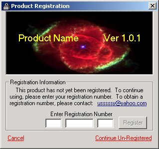



## Trial Use

### Description

FORCE someone to register an app. This program checks for a .dll that is non-existing creating an error. On error the program continues loading depending on how many "uses" you provide with your software. Even if the .dll is deleted, the registry "runcount" will create it again and force the user to register. It's pretty much commented and what's not commented is common sense. Enjoy and PLEASE post feed-back.
 
### More Info
 

             |
---                |---
**Submitted On**   |2004-10-14 19:26:54
**By**             |[AJ Trahan](https://github.com/Planet-Source-Code/PSCIndex/blob/master/ByAuthor/aj-trahan.md)
**Level**          |Beginner
**User Rating**    |5.0 (15 globes from 3 users)
**Compatibility**  |VB 6\.0
**Category**       |[Complete Applications](https://github.com/Planet-Source-Code/PSCIndex/blob/master/ByCategory/complete-applications__1-27.md)
**World**          |[Visual Basic](https://github.com/Planet-Source-Code/PSCIndex/blob/master/ByWorld/visual-basic.md)
**Archive File**   |[Trial\_Use18051910142004\.zip](https://github.com/Planet-Source-Code/aj-trahan-trial-use__1-56738/archive/master.zip)

